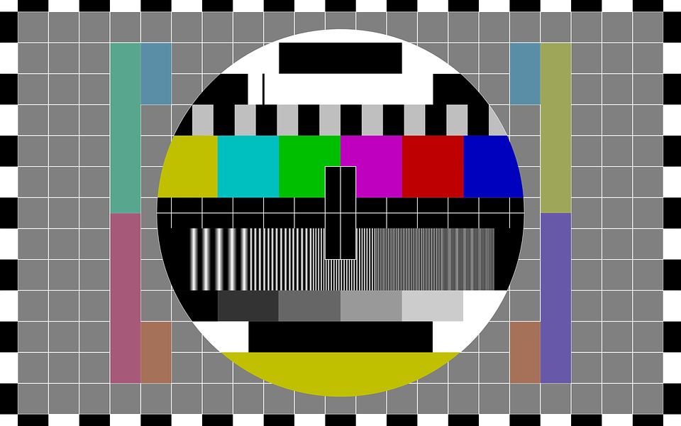

# TODO LIST

1. Set the big picture of rigging referencing structure
3. Set the project file structure
4. Get the list of available tools
5. Create a list of locomotion clips
6. Sort the list of clips by priority
7. Create a list of time wasters that can be scripted later

